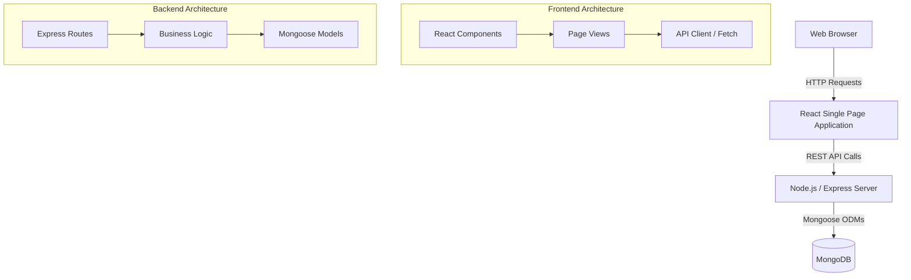
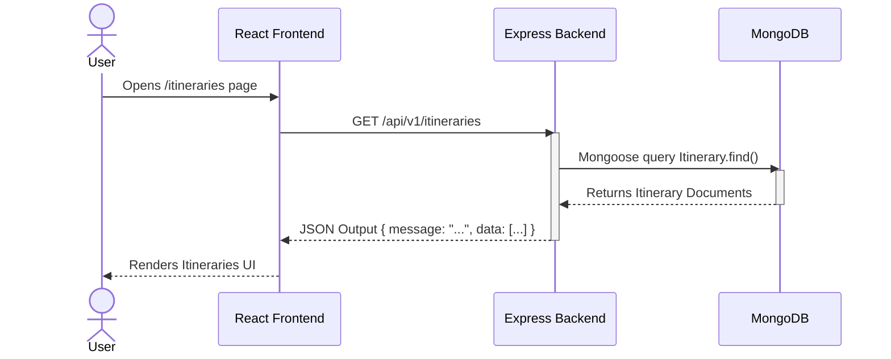

# Kashmir Travel App - Architecture Documentation

## System Overview

The Kashmir Travel App is a modern, full-stack web application designed to help users explore and book travel itineraries in Kashmir. It follows a standard Client-Server architecture with a decoupled frontend and backend.

## Architecture Diagram

The system consists of three main tiers:
1. **Presentation Layer (Frontend):** A React application built with Vite and TailwindCSS.
2. **Application Layer (Backend):** A RESTful API built with Node.js and Express.
3. **Data Layer (Database):** A MongoDB database for persistent data storage.

## Data Flow & Integration

### 1. Fetching Itineraries Flow

The following sequence diagram illustrates how data flows when a user requests to view travel itineraries.

## Frontend Structure (React + Vite)
- **Framework:** React
- **Build Tool:** Vite for fast HMR and optimized production builds.
- **Styling:** TailwindCSS for utility-first styling.
- **Main Entry:** `main.jsx` mounts the App.
- **Components:** Reusable UI elements are placed in `src/components`.
- **Pages:** Top-level view components are placed in `src/pages`.

## Backend Structure (Node.js + Express)
- **Server:** Express.js handles incoming HTTP traffic.
- **Entry Point:** `server.js` configures middlewares (CORS, JSON parser) and routes.
- **Database:** MongoDB configured with Mongoose.
- **Models:** Schema definitions for data structures (e.g., `Itinerary.js`).

## Security & Middleware
- **CORS:** Configured to allow cross-origin requests from the React frontend.
- **Environment Variables:** Confidential configurations (like `MONGO_URI` and `PORT`) are managed via `.env` using `dotenv`.
